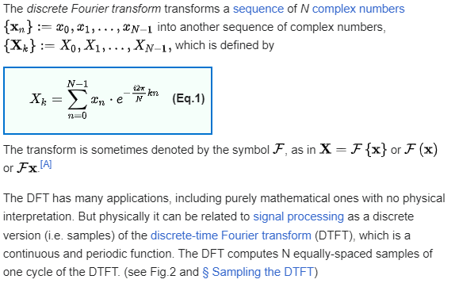
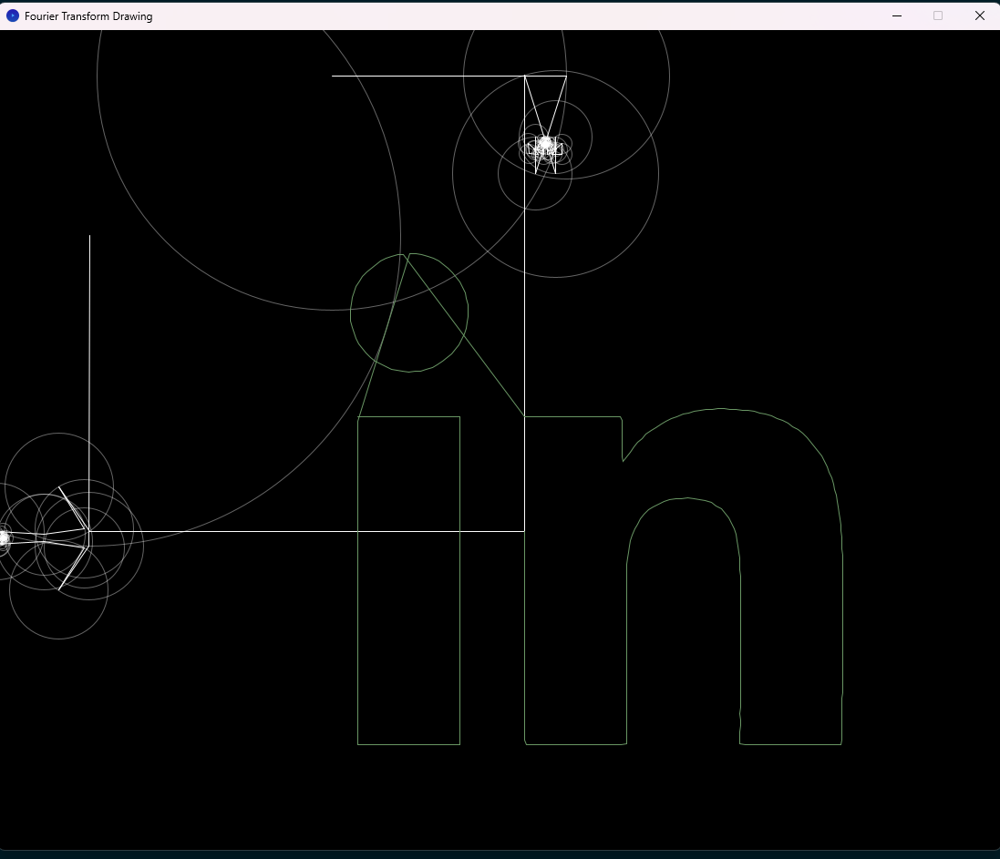
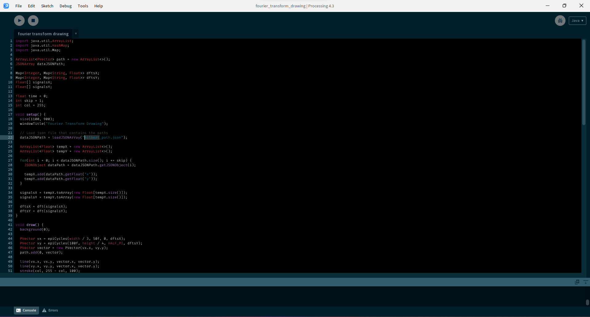

# Drawing with circles using Fourier Transform and Epicycles

### What is DFT (Discrete Fourier Transform)?

In mathematics, the discrete Fourier transform (DFT) converts a finite sequence of equally-spaced samples of a function into a same-length sequence of equally-spaced samples of the discrete-time Fourier transform (DTFT), which is a complex-valued function of frequency. The interval at which the DTFT is sampled is the reciprocal of the duration of the input sequence. An inverse DFT (IDFT) is a Fourier series, using the DTFT samples as coefficients of complex sinusoids at the corresponding DTFT frequencies. It has the same sample-values as the original input sequence. The DFT is therefore said to be a frequency domain representation of the original input sequence. If the original sequence spans all the non-zero values of a function, its DTFT is continuous (and periodic), and the DFT provides discrete samples of one cycle. If the original sequence is one cycle of a periodic function, the DFT provides all the non-zero values of one DTFT cycle.

For more details, go to:
- [https://en.wikipedia.org/wiki/Discrete_Fourier_transform](https://en.wikipedia.org/wiki/Discrete_Fourier_transform).
- [https://www.algorithm-archive.org/contents/cooley_tukey/cooley_tukey.html](https://www.algorithm-archive.org/contents/cooley_tukey/cooley_tukey.html)

### Preview

### How to run this project

Firstly, you need to download and install Processing. 

Processing is a flexible software sketchbook and a language for learning how to code. Since 2001, Processing has promoted software literacy within the visual arts and visual literacy within technology. There are tens of thousands of students, artists, designers, researchers, and hobbyists who use Processing for learning and prototyping.

You can download it here: [https://processing.org/download](https://processing.org/download)

You can then open this project in the Processing and click the run button on the upper right corner of the screen.

